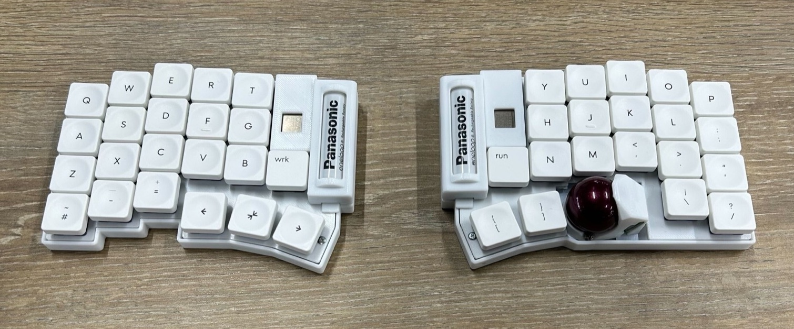
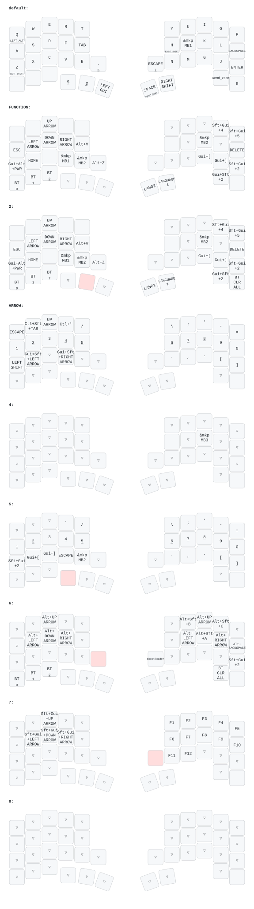

[torabo-tsuki LP](https://github.com/sekigon-gonnoc/torabo-tsuki-lp)用のZMKファームウェア

- キーマップは[keymap-editor](https://nickcoutsos.github.io/keymap-editor/)で編集できます

## ファームウェアの書き込み

キーマップを変更したら、GitHub Actions でビルドされた uf2 を左右それぞれに書き込みます。

### 書き込むファイル

この機体は**右手にトラックボール**があるため、トラックボール側が Central、反対側が Peripheral です。

| 書き込み先 | ファイル |
| ---------- | -------- |
| **右手**（トラックボール側 / Central） | `torabo_tsuki_lp_right_central.uf2` |
| **左手**（Peripheral） | `torabo_tsuki_lp_left_peripheral.uf2` |

### 1. ファームウェアを取得する

1. `config/keymap.keymap` を変更して push すると、GitHub Actions のビルドが自動で走ります
2. [Actions](../../actions) から該当の run を開きます
3. ページ下部の **Artifacts** にある `firmware.zip` をダウンロードして解凍します
4. 上表の2ファイルが入っていることを確認します

### 2. キーマップ変更時の書き込み手順

左右同時ではなく、**片方ずつ**行います。

1. キーボードのスライドスイッチを **OFF** にする
2. USB ケーブルで PC に接続する
   - OFF のまま接続するとブートローダが起動し、`BLEMICROPRO` という名前のストレージがマウントされます（中に `INFO_UF2.TXT` があることを確認）
3. 対応する uf2 をそのストレージにコピーする
4. 書き込みが完了すると自動で再起動し、ストレージが一度切断されて再接続されます
5. USB ケーブルを抜き、スイッチを **ON** にする
6. もう片方についても 1〜5 を繰り返す
7. 右手（Central）側の電源を入れて動作確認する

> [!NOTE]
> キーマップの変更だけなら、これで完了です。設定リセットやペアリングのやり直しは不要で、左右のペアリングと PC との Bluetooth 接続はそのまま維持されます。

### 3. 設定をリセットする場合（settings_reset）

以下のようなときは `settings_reset-bmp_boost-zmk.uf2` で設定を初期化します。

- 左右が繋がらない / 片側だけ反応しない
- PC との Bluetooth 接続が不安定、プロファイルを消したい
- ZMK のバージョンを上げた、split 構成（central/peripheral）を入れ替えた

> [!IMPORTANT]
> settings_reset は uf2 を書き込むだけでは動作しません。**書き込み後に一度再起動する必要があります。**

左右の**両方**に対して、次を行います。

1. スイッチを **OFF** → USB 接続 → `settings_reset-bmp_boost-zmk.uf2` を書き込む
2. USB を抜く → スイッチを **ON** → USB を接続し直す
   - ここで settings_reset のファームウェアが動作し、設定が初期化されます
3. 左右とも 1〜2 が終わったら、**通常のファームウェアを書き直す**（「2. キーマップ変更時の書き込み手順」を左右それぞれに実施）
   - settings_reset を書いた状態ではキーボードとして動作しないため、この手順は必須です
4. 左右をほぼ同時に起動させると、Central と Peripheral がペアリングしやすくなります
5. PC 側に残っている古い Bluetooth プロファイルは削除し、ペアリングし直します

### 注意点

- 普段使いや USB 有線接続のときは、**必ずスイッチを ON にしてからケーブルを挿します**。OFF で挿すとブートローダが起動してキーボードとして動作しません
- **左手（Peripheral）を USB 接続してもキー入力はできません**。ZMK の仕様なので故障ではなく、動作確認は右手（Central）側で行ってください
- レイヤー6 の `&bootloader` キーからもブートローダを起動できます

出典: [torabo-tsuki LP ビルドガイド](https://github.com/sekigon-gonnoc/torabo-tsuki-lp/blob/master/build-guide.md) / [ZMK: Reset Split Keyboard](https://zmk.dev/docs/troubleshooting/connection-issues)

## キーマップ



### キーマップ画像の生成

[keymap-drawer](https://github.com/caksoylar/keymap-drawer)を使用してSVGを生成しています。

```bash
# インストール（初回のみ）
pipx install keymap-drawer

# キーマップの解析とSVG生成
keymap parse -z config/keymap.keymap -c 10 -o keymap.yaml
keymap draw -j config/info.json keymap.yaml -o keymap.svg

# コンボの線を非表示にする場合
keymap draw -j config/info.json keymap.yaml -o keymap.svg --keys-only
```

---

## レイヤー構成

| レイヤー | 名前         | 説明                                           |
| -------- | ------------ | ---------------------------------------------- |
| 0        | default      | 通常入力用のベースレイヤー                     |
| 1        | FUNCTION     | 矢印キー、スクリーンショット、BT設定           |
| 2        | CMD_SLOW     | トラックボール低速モード（60%速度）+ FUNCTION  |
| 3        | ARROW        | 矢印キーと数字キー                             |
| 4        | MOUSE        | マウス操作用（トラックボール低速モード）       |
| 5        | SCROLL       | スクロールモード + 数字キー                    |
| 6        | layer_6      | ウィンドウ操作（Figma等）、bootloader          |
| 7        | layer_7      | ファンクションキー（F1-F12）                   |
| 8        | ZOOM         | ズームモード（Cmd+スクロール）                 |

---

## 機能

### トラックボール機能

| 機能               | レイヤー | 説明                                         |
| ------------------ | -------- | -------------------------------------------- |
| **通常モード**     | 0, 1, 3  | 標準のマウスカーソル移動                     |
| **低速モード**     | 2, 4     | 60%速度で精密な操作が可能                    |
| **スクロールモード** | 5        | トラックボールでスクロール操作               |
| **ズームモード**   | 8        | Cmd+スクロールでズーム（Figma等で使用）      |

### 特殊キー

| キー         | 動作                                              |
| ------------ | ------------------------------------------------- |
| `&mo 2`      | 押している間レイヤー2（低速モード）に切り替え     |
| `&cmd_zoom`  | 押している間レイヤー8 + Cmdキー（ズーム操作用）   |
| `&mt`        | Mod-Tap: 長押しで修飾キー、タップで通常キー       |
| `&lt`        | Layer-Tap: 長押しでレイヤー切替、タップで通常キー |

### タイミング設定

- `tapping-term-ms`: 180ms（ホールドとタップの判定時間）

---

## フォーク元からの変更点

このリポジトリは[オリジナルのtorabo-tsuki LPファームウェア](https://github.com/sekigon-gonnoc/zmk-keyboard-torabo-tsuki-lp)をフォークし、以下の変更を行っています。

### 主な変更点

- ZMK v0.3 へアップデート
- deepsleep時の消費電力改善（`NRF_GPIO_DRIVE_H0H1`）
- カスタムキーマップ（8レイヤー構成）
- トラックボール低速モード、ズームモード対応

### レイアウト

| 項目       | オリジナル | 変更後            |
| ---------- | ---------- | ----------------- |
| **キー数** | 61キー     | 42キー（Sサイズ） |
| **行数**   | 5行        | 4行               |

keymap-editor用のレイアウト定義（`config/info.json`）も42キーのコンパクトレイアウトに対応しています。
